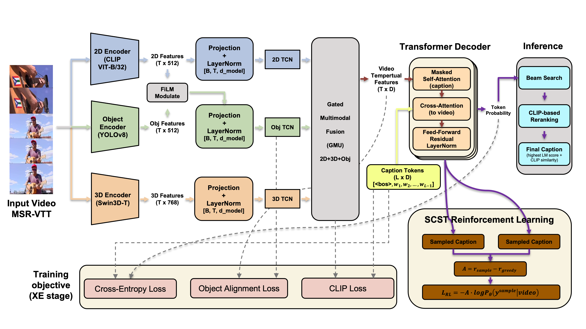

# Temporally Gated Alignment Fusion for Multi-stream Video Captioning 

[](https://colab.research.google.com/drive/1lhOMfktB_s_WiRzT0XotOgHLi6VUomlA?usp=drive_link)
[](https://opensource.org/licenses/MIT)

> **Official implementation of the TGAF framework.** This project focuses on high-fidelity video captioning on MSR-VTT by dynamically fusing 2D appearance, 3D motion, and fine-grained object features through a temporally gated Transformer architecture.

<p align="center">
  
  <br>
  <em>Figure 1: Overview of the Temporally Gated Alignment Fusion (TGAF) framework.</em>
</p>

---

## ✨ Key Features

### 🖼️ Multi-stream Feature Extraction
- **2D Stream:** High-level semantics via **CLIP ViT-B/32** frame features.
- **3D Stream:** Spatiotemporal motion cues via **Swin3D-T** video backbones.
- **Object Stream:** Fine-grained grounding via **YOLOv8** proposals + **CLIP** pooled embeddings.

### 🧠 Advanced Fusion Architecture
- **Temporal Encoding:** Dilated **TCN** (Temporal Convolutional Network) for long-range dependency modeling across all streams.
- **Gated Alignment:** Adaptive multi-stream fusion (2D ↔ 3D) with dynamic object feature injection.
- **Decoder:** Transformer-based decoder with **per-token gating** and cross-attention over visual streams.

### 📈 Optimized Training & Inference

- **Stage 1 (XE Pretraining):** Train the captioner with standard **Cross-Entropy (XE)**.
  - **Optional:** Add **CLIP/Object alignment losses** to improve visual grounding and reduce language-prior bias.
- **Stage 2 (Optional, SCST):** Fine-tune with **Self-Critical Sequence Training (SCST)** to directly optimize **CIDEr**.
- **Inference:** Decode captions with **Beam Search** (supports length and repetition controls).
  - **Optional (CLIP-guided Reranking):** Re-rank top-*K* beam candidates using CLIP video–text similarity to improve semantic consistency.

---

## Repository Layout

```text
TGAF/
├── configs/                         # YAML experiment configs (MSR-VTT variants)
├── scripts/
│   ├── prepare_splits.py            # build train/val split json
│   ├── extract_features.py          # 2D/3D feature extraction
│   ├── extract_object_features.py   # object feature extraction (YOLOv8 + CLIP)
│   ├── build_vocab.py               # SentencePiece BPE tokenizer
│   ├── train.py                     # XE training
│   ├── train_scst.py                # SCST training (CIDEr)
│   ├── eval.py                      # decoding + evaluation
│   ├── visual_examples.py           # qualitative comparison table
│   ├── scan_gates.py                # find “interesting” videos by gate statistics
│   ├── visual_gates.py              # visualize learned gates for a video
│   └── visualize_features.py        # frame strip + curve visualization
├── src/
│   ├── data/                        # dataset + collate
│   ├── models/                      # TCN, decoder, fusion/gates, full model
│   └── utils/                       # video I/O, tokenizer wrapper, extractors
├── data/                            # (not tracked) raw videos, splits, features
└── outputs/                         # (not tracked) checkpoints, logs, predictions
```

## 📓 Quick Start (Google Colab)

The easiest way to run this project from scratch is via our interactive notebook. It covers environment setup, data preparation, feature extraction, and training.

👉 **[Launch Demo on Colab](https://colab.research.google.com/drive/1lhOMfktB_s_WiRzT0XotOgHLi6VUomlA?usp=drive_link)**

## 🛠️ Installation

```bash
# Clone the repo
git clone https://github.com/Alan3883/TGAF.git
cd TGAF

# Install dependencies
pip install -r requirements.txt
pip install git+https://github.com/salaniz/pycocoevalcap

# Optional: Object extraction dependencies
pip install ultralytics
```
## 📦 Data Preparation (MSR-VTT)

### 1. Expected Structure
Place your raw video assets in the following directory:

```text
data/msrvtt/raw/
├── MSRVTT_Videos/video/*.mp4
├── msrvtt_train_7k.json
└── msrvtt_test_1k.json
```

### 2. Preprocessing
Run the following scripts to prepare the data splits and build the vocabulary:
```bash
# Generate train/val/test split JSONs
python scripts/prepare_splits.py --val_ratio 0.05

# Build SentencePiece BPE Tokenizer (16k vocab)
python scripts/build_vocab.py \
  --splits data/msrvtt/splits \
  --out outputs/spm/bpe16k.model \
  --vocab_size 16000
```

## ⚡ Pipeline & Training

### 1. Feature Extraction

<details>
<summary><b>Commands</b></summary>

<br>

**CLIP-ViT-B/32 (2D Features)**

```bash
python -m scripts.extract_features \
  --input_dir data/msrvtt/raw/MSRVTT_Videos/video \
  --json_file data/msrvtt/splits/msrvtt_train.json \
  --out_dir data/msrvtt/features_vit32/train \
  --backbone clip-vit --max_frames 32 --fps 3
```

**Swin3D (3D Features)**

```bash
python -m scripts.extract_features \
  --input_dir data/msrvtt/raw/MSRVTT_Videos/video \
  --json_file data/msrvtt/splits/msrvtt_train.json \
  --out_dir data/msrvtt/features_vit32/train \
  --backbone swin3d --max_frames 32 --fps 3
```

**Object Features (YOLOv8 + CLIP)**

```bash
python -m scripts.extract_object_features \
  --input_dir data/msrvtt/raw/MSRVTT_Videos/video \
  --json_file data/msrvtt/splits/msrvtt_train.json \
  --out_dir data/msrvtt/features_vit32/train \
  --yolo_model yolov8x.pt --max_objects 8
```

Note: Please repeat the extraction for val and test splits.

</details>

### 2. Training Phases

<details> <summary><b>Commands</b></summary> <br>

All training and evaluation are config-driven using the YAML files in `configs/`.

| Phase | Description | Command |
| :--- | :--- | :--- |
| **XE (ResNet50 Baseline)** | Train a lightweight baseline using ResNet50 features. | `python -m scripts.train --config configs/msrvtt_resnet50.yaml` |
| **Eval (ResNet50 Baseline)** | Evaluate the ResNet50 baseline checkpoint. | `python -m scripts.eval --config configs/msrvtt_resnet50.yaml --checkpoint outputs/exp_msrvtt_resnet50_baseline/best.pt` |
| **XE (2D Only)** | Train with **CLIP ViT-B/32 2D** stream only. | `python -m scripts.train --config configs/msrvtt_vit32_2d.yaml` |
| **Eval (2D Only)** | Evaluate the 2D-only checkpoint. | `python -m scripts.eval --config configs/msrvtt_vit32_2d.yaml --checkpoint outputs/exp_msrvtt_vit32_2d/best.pt` |
| **XE (2D + 3D)** | Train with fused **2D + Swin3D** streams. | `python -m scripts.train --config configs/msrvtt_vit32_2d_3d.yaml` |
| **Eval (2D + 3D)** | Evaluate the 2D+3D checkpoint. | `python -m scripts.eval --config configs/msrvtt_vit32_2d_3d.yaml --checkpoint outputs/exp_msrvtt_vit32_2d_3d/best.pt` |
| **XE (2D + 3D + Obj)** | Train with **object injection** (YOLOv8+CLIP) in addition to 2D+3D. | `python -m scripts.train --config configs/msrvtt_vit32_baseline.yaml` |
| **Eval (2D + 3D + Obj)** | Evaluate the baseline multi-stream checkpoint. | `python -m scripts.eval --config configs/msrvtt_vit32_baseline.yaml --checkpoint outputs/exp_msrvtt_vit32_baseline/best.pt` |
| **XE (+ Alignment Loss)** | Enable CLIP/object alignment losses during XE training. | `python -m scripts.train --config configs/msrvtt_vit32_clip.yaml` |
| **Eval (Beam Search)** | Beam decoding with length & repetition controls (no CLIP rerank). | `python -m scripts.eval --config configs/msrvtt_vit32_clip.yaml --checkpoint outputs/exp_msrvtt_vit32_clip/best.pt --beam_width 3 --beam_rerank_k 3 --length_alpha 0.9 --repetition_penalty 1.1` |
| **Eval (+ CLIP Rerank)** | CLIP-guided reranking over top-*K* beams. | `python -m scripts.eval --config configs/msrvtt_vit32_clip_rerank.yaml --checkpoint outputs/exp_msrvtt_vit32_clip/best.pt --clip_rerank --clip_lambda 2.5 --beam_width 3 --beam_rerank_k 3 --length_alpha 0.9 --repetition_penalty 1.1` |
| **SCST (RL Fine-tuning)** | SCST fine-tuning from an XE checkpoint (optimize CIDEr). | `python -m scripts.train_scst --config configs/msrvtt_vit32.yaml --checkpoint outputs/exp_msrvtt_vit32_clip/best.pt --output_dir outputs/exp_msrvtt_vit32_scst --epochs 3 --batch_size 8 --lr 5e-6 --alpha_xe 1.0 --topk 5` |
| **Eval (SCST + CLIP Rerank)** | Final evaluation using SCST checkpoint + CLIP reranking. | `python -m scripts.eval --config configs/msrvtt_vit32.yaml --checkpoint outputs/exp_msrvtt_vit32_scst/best_scst.pt --clip_rerank --clip_lambda 2.5 --beam_width 3 --beam_rerank_k 3 --length_alpha 0.9 --repetition_penalty 1.1` |

</details>

---

## 📊 Experimental Results

The following table shows the ablation study of different components and their impact on standard metrics.

| Method | BLEU-4 | METEOR | ROUGE-L | CIDEr |
| :--- | :---: | :---: | :---: | :---: |
| 2D (CLIP-ViT) | 0.4332 | 0.2784 | 0.6085 | 0.4841 |
| 2D + 3D | 0.4478 | 0.2808 | 0.6181 | 0.4954 |
| 2D + 3D + Obj | 0.4371 | 0.2815 | 0.6117 | 0.4911 |
| + CLIP alignment loss | 0.4473 | 0.2903 | 0.6220 | 0.5096 |
| + Beam Rerank | 0.4526 | 0.2923 | 0.6243 | 0.5243 |
| **RL + Rerank (Full Model)** | **0.4556** | **0.3021** | **0.6351** | **0.5546** |

> **Note:** **RL** denotes Self-Critical Sequence Training (SCST); **Obj** denotes the injection of YOLOv8+CLIP object-level features.

---

## 📄 License

This project is licensed under the **MIT License**. See the [LICENSE](LICENSE) file for more details.

---

## 🙏 Acknowledgements

We would like to thank the following projects and communities for their invaluable contributions to this research:

* **[MSR-VTT](https://ms-rop.github.io/msrvtt/)**: For providing the large-scale video captioning dataset.
* **[OpenAI CLIP](https://github.com/openai/CLIP)**: For the powerful 2D semantic feature representations.
* **[Swin3D](https://github.com/microsoft/Swin-Transformer)**: For the spatiotemporal video backbones.
* **[Ultralytics YOLOv8](https://github.com/ultralytics/ultralytics)**: For the efficient object detection used in our feature pipeline.
* **[pycocoevalcap](https://github.com/salaniz/pycocoevalcap)**: For the evaluation metrics (Bleu, METEOR, ROUGE, CIDEr).
* **PyTorch Community**: For the robust framework that powers our implementation.

---

> If you find this project useful for your research, please consider giving it a ⭐!


